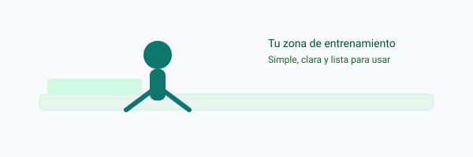

#  ZonaFitSpring

Bienvenido a ZonaFitSpring — una base simple para gestionar funcionalidades de un centro deportivo con Spring. Este README explica de forma clara cómo usar el proyecto, qué hace y cómo colaborar.

---

Qué es

- ZonaFitSpring es un proyecto plantilla pensado para gestionar funciones básicas de un centro deportivo: usuarios, clases, reservas y pequeñas estadísticas.
- Está escrito para ser fácil de entender y ampliar.

Por qué sirve

- Te ayuda a comenzar rápido con una estructura organizada.
- Tiene lo básico para probar ideas sin lidiar con configuraciones complejas.

Características principales

- Registro y gestión de usuarios
- Creación y listado de clases o sesiones
- Reservas simples por usuario
- Puntos de partida para añadir tu UI o app móvil

Requisitos

- Java 17+ instalado
- Maven o Gradle (si el proyecto tiene wrapper, puedes usar ./mvnw o ./gradlew)
- Un IDE (IntelliJ, VS Code, Eclipse) recomendado pero no obligatorio

Cómo ejecutar

1. Abrir una terminal en la carpeta del proyecto.
2. Si existe el wrapper, preferirlo: en Windows:

   mvnw spring-boot:run

   o con Maven instalado:

   mvn spring-boot:run

3. La aplicación se ejecuta como una aplicación de consola o servicio y no expone una interfaz web por defecto. Revisa la salida en la consola para ver su comportamiento y resultados.

Construir para producción

- Empaqueta la aplicación:

  mvn package

- Ejecuta el JAR generado:

  java -jar target/tu-app.jar

Estructura del proyecto

- src/main/java — código de la aplicación (lógica, controladores, servicios)
- src/main/resources — archivos de configuración y plantillas
- src/test — pruebas para validar que lo básico funciona

Consejos rápidos

- Si algo no arranca, mira la consola: ahí suele decir qué falta, por ejemplo Java no encontrado.
- Para probar cambios, modifica el código y reinicia la app.

